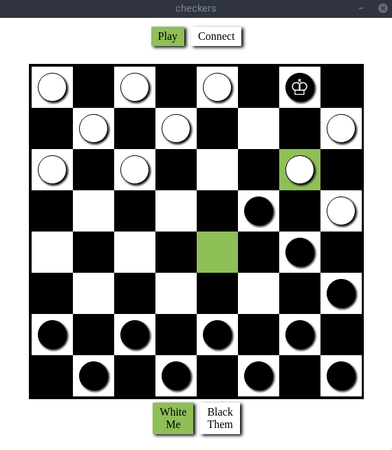

# checkers

> Checkers app built on electron-vue.

#### Screenshot


#### How to Play

1. Launch two instances of app.
  - On linux: `yarn run build` then run two instances of `build/checkers*.AppImage`
2. Go to 'connect' page on both clients.
3. On either of the clients, start the server. Then, on that same client, connect to "yourself".
4. On the other client, connect to the server running on the other client.
5. On both clients, go back to the 'play' page and play a game!

#### Build Setup

``` bash
# install dependencies
yarn install

# serve with hot reload at localhost:9080
yarn run dev

# build electron application for production
yarn run build

# run unit & end-to-end tests
yarn test


# lint all JS/Vue component files in `src/`
yarn run lint

```

---

This project was generated with [electron-vue](https://github.com/SimulatedGREG/electron-vue)@[cf53551](https://github.com/SimulatedGREG/electron-vue/tree/cf53551a209b49220525e7de80f1c541d7096aef) using [vue-cli](https://github.com/vuejs/vue-cli). Documentation about the original structure can be found [here](https://simulatedgreg.gitbooks.io/electron-vue/content/index.html).
